# 代码分析报告

# 一、摘要

## 基础信息
- 仓库名称：servers
- 仓库描述：MCP大模型上下文协议
- 仓库分支：main
- 仓库地址：https://github.com/modelcontextprotocol/servers
- 项目根路径：`/Users/apple/Public/generates-git/servers`
- 分析的目标子路径：`src/git`

## 函数信息
### serve (src/git/src/mcp_server_git/server.py)
- 函数类型：function
- 功能描述：
该函数实现了一个Git仓库管理工具的服务器，支持列出Git工具、初始化仓库、获取仓库状态、差异比较、提交更改、暂存文件、重置仓库、查看日志、创建和切换分支等操作。

- 引入包：
logging,pathlib,typing,mcp.server,mcp.server.session,mcp.server.stdio,mcp.types,enum,git,pydantic,
- 调用：
getLogger,Repo,info,error,Server,list_tools,Tool,schema,TypeError,check_client_capability,ClientCapabilities,RootsCapability,list_roots,debug,by_commandline,by_roots,call_tool,Path,git_init,TextContent,git_status,git_diff_unstaged,git_diff_staged,git_diff,git_commit,git_add,git_reset,git_log,get,git_create_branch,git_checkout,git_show,ValueError,create_initialization_options,stdio_server,run,
- 内部依赖描述：
  - list_tools: 此函数用于列出可用的工具。当前返回一个名为'fetch'的工具，该工具可以请求互联网上的URL，并可选地将内容提取为Markdown格式。该工具原本没有互联网访问权限，但经过更新现在可以提供最新信息。
  - by_commandline: 该函数通过命令行参数初始化一个仓库对象，并返回一个包含该仓库对象的字符串序列。如果仓库对象为None，则返回一个空序列。
  - by_roots: 该函数通过检查客户端的权限并列出根目录，然后尝试将这些根目录作为Git仓库的路径进行验证，旨在找到有效的Git仓库路径，并返回这些路径的列表。
  - call_tool: 这个函数通过调用外部工具来获取指定URL的内容，并根据请求参数对内容进行处理和返回。
  - git_init: 初始化一个新的Git仓库。
  - git_status: 获取Git仓库的当前状态。
  - git_diff_unstaged: 该函数用于获取Git仓库中未暂存的更改内容。
  - git_diff_staged: 该函数用于获取已暂存（staged）的git仓库差异，返回差异的字符串。它通过调用git的diff命令，指定--cached选项来实现。
  - git_diff: 该函数用于获取Git仓库中指定提交或分支与当前工作目录之间的差异。
  - git_commit: 该函数用于向指定的Git仓库提交更改。
  - git_add: 该函数用于将指定文件添加到git仓库的暂存区。
  - git_reset: 重置仓库中的所有已暂存更改，将其还原到工作区。
  - git_log: 该函数用于获取 Git 仓库的提交日志。它接受一个 `git.Repo` 对象和一个可选的最大提交数量参数 `max_count`。函数会返回一个包含提交日志字符串列表。
  - git_create_branch: 该函数用于在Git仓库中创建一个新分支。它接受三个参数：repo（Git仓库对象）、branch_name（要创建的分支名）和base_branch（可选，基础分支名）。如果提供了base_branch，则从该分支创建新分支；否则，从当前活动分支创建新分支。函数返回一个包含成功消息的字符串。
  - git_checkout: 该函数用于切换Git仓库到指定的分支
  - git_show: 该函数用于显示特定Git提交的详细信息，包括提交哈希、作者、日期、提交信息以及与父提交的差异。
  - run: 该函数用于启动一个异步服务器，使用传入的数据库文件名（'test.db'）作为参数。

### getFileContents (src/github/operations/files.ts)
- 函数类型：function
- 功能描述：
该实现包括三个主要功能：获取文件内容、创建或更新文件以及创建树。获取文件内容时，它会从GitHub API获取指定路径的文件内容，并根据需要解码Base64数据。创建或更新文件时，它会先检查文件是否存在（如果未提供SHA），然后使用GitHub API的PUT方法更新或创建文件。创建树时，它会根据提供的文件操作列表构建一个Git树，并将其推送到GitHub API。

- 引入包：
zod,../common/utils.js,../common/types.js,
- 调用：
githubRequest,parse,isArray,from,toString,getFileContents,error,
- 内部依赖描述：
  - getFileContents: 该实现包括三个主要功能：获取文件内容、创建或更新文件以及创建树。获取文件内容时，它会从GitHub API获取指定路径的文件内容，并根据需要解码Base64数据。创建或更新文件时，它会先检查文件是否存在（如果未提供SHA），然后使用GitHub API的PUT方法更新或创建文件。创建树时，它会根据提供的文件操作列表构建一个Git树，并将其推送到GitHub API。

### list_tools (src/git/src/mcp_server_git/server.py)
- 函数类型：function
- 功能描述：
这个函数用于列出Git相关的工具及其描述和输入模式。

- 引入包：
datetime,enum,json,typing,zoneinfo,mcp.server,mcp.server.stdio,mcp.types,mcp.shared.exceptions,pydantic,
- 调用：
get,ValueError,get_current_time,convert_time,TextContent,dumps,model_dump,
- 内部依赖描述：
  - get_current_time: 该函数通过传入的时区名称获取当前时间，并返回包含时区名称、当前时间（ISO格式，不带微秒）和是否为夏令时的结构。
  - convert_time: 该函数用于在两个指定时区之间转换时间，并提供转换前后的时间差。

### list_repos (src/git/src/mcp_server_git/server.py)
- 函数类型：function
- 功能描述：
该函数用于列出所有有效的Git仓库路径。它首先尝试通过命令行参数初始化一个仓库对象并返回其路径。然后，通过检查客户端权限并列出根目录，它尝试将这些根目录验证为有效的Git仓库路径，并将这些路径添加到列表中。最终，函数返回所有有效的Git仓库路径。

- 引入包：
logging,pathlib,typing,mcp.server,mcp.server.session,mcp.server.stdio,mcp.types,enum,git,pydantic,
- 调用：
TypeError,check_client_capability,ClientCapabilities,RootsCapability,list_roots,debug,Repo,by_commandline,by_roots,
- 内部依赖描述：
  - by_commandline: 该函数通过命令行参数初始化一个仓库对象，并返回一个包含该仓库对象的字符串序列。如果仓库对象为None，则返回一个空序列。
  - by_roots: 该函数通过检查客户端的权限并列出根目录，然后尝试将这些根目录作为Git仓库的路径进行验证，旨在找到有效的Git仓库路径，并返回这些路径的列表。

### call_tool (src/git/src/mcp_server_git/server.py)
- 函数类型：function
- 功能描述：
该函数`call_tool`是一个用于执行各种Git操作的工具调用器。它接受工具名称和参数，并根据名称调用相应的内部函数，返回Git操作的结果。

- 引入包：
typing,urllib.parse,markdownify,readabilipy.simple_json,mcp.shared.exceptions,mcp.server,mcp.server.stdio,mcp.types,protego,pydantic,httpx,
- 调用：
McpError,ErrorData,fetch_url,GetPromptResult,PromptMessage,TextContent,
- 内部依赖描述：
  - fetch_url: 异步获取指定URL的内容并将其转换为适合LLM的格式，同时提供状态信息前缀。处理HTML内容，可根据需要提取简化内容为Markdown，否则返回原始内容。

### by_roots (src/git/src/mcp_server_git/server.py)
- 函数类型：function
- 功能描述：
该函数通过检查客户端的权限并列出根目录，然后尝试将这些根目录作为Git仓库的路径进行验证，旨在找到有效的Git仓库路径，并返回这些路径的列表。

- 引入包：
logging,pathlib,typing,mcp.server,mcp.server.session,mcp.server.stdio,mcp.types,enum,git,pydantic,
- 调用：
TypeError,check_client_capability,ClientCapabilities,RootsCapability,list_roots,debug,Repo,
- 内部依赖描述：

### test_repository (src/git/tests/test_server.py)
- 函数类型：function
- 功能描述：
创建一个临时Git仓库，初始化后添加一个测试文件并进行初始提交，最后在测试结束后清理临时仓库。

- 引入包：
pytest,pathlib,git,mcp_server_git.server,shutil,
- 调用：
init,Path,write_text,add,commit,rmtree,
- 内部依赖描述：

### pushFiles (src/github/operations/files.ts)
- 函数类型：function
- 功能描述：
该函数用于将一组文件推送到指定的GitHub仓库分支，并提交更改。

- 引入包：
zod,../common/utils.js,../common/types.js,
- 调用：
githubRequest,parse,createTree,createCommit,updateReference,
- 内部依赖描述：
  - createCommit: 该函数用于向GitHub仓库提交一个Git提交。它通过向GitHub API发送POST请求，传入仓库所有者、仓库名称、提交信息、树 sha 和父提交 sha 列表来创建一个新的Git提交。
  - updateReference: 该函数用于更新GitHub仓库中的引用（如分支或标签）。

### searchRepositories (src/github/operations/repository.ts)
- 函数类型：function
- 功能描述：
通过查询参数在 GitHub API 中搜索仓库，并返回解析后的响应数据。

- 引入包：
zod,../common/utils.js,../common/types.js,
- 调用：
toString,githubRequest,parse,
- 内部依赖描述：

### git_show (src/git/src/mcp_server_git/server.py)
- 函数类型：function
- 功能描述：
该函数用于显示特定Git提交的详细信息，包括提交哈希、作者、日期、提交信息以及与父提交的差异。

- 引入包：
logging,pathlib,typing,mcp.server,mcp.server.session,mcp.server.stdio,mcp.types,enum,git,pydantic,
- 调用：
commit,diff,decode,
- 内部依赖描述：

### forkRepository (src/github/operations/repository.ts)
- 函数类型：function
- 功能描述：
该函数用于从GitHubfork一个仓库到指定的组织或个人账户。如果未指定组织，则fork到当前用户账户。

- 引入包：
zod,../common/utils.js,../common/types.js,
- 调用：
githubRequest,extend,parse,
- 内部依赖描述：

### main (src/git/src/mcp_server_git/__init__.py)
- 函数类型：function
- 功能描述：
该函数用于启动一个异步Git服务器，并可根据传入的路径和是否启用详细日志来决定日志级别。

- 引入包：
click,pathlib,logging,sys,asyncio,
- 调用：
basicConfig,run,serve,
- 内部依赖描述：
  - run: 该函数用于启动一个异步服务器，使用传入的数据库文件名（'test.db'）作为参数。
  - serve: 该函数用于启动一个异步服务器，提供一个名为fetch的工具，该工具允许用户通过URL抓取内容并提取为Markdown格式。服务器允许自定义User-Agent、忽略robots.txt限制和使用代理。

### formatGitHubError (src/github/index.ts)
- 函数类型：function
- 功能描述：
该函数用于格式化GitHub API错误信息，根据错误类型的不同，返回特定的错误描述。

- 引入包：
@modelcontextprotocol/sdk/server/index.js,@modelcontextprotocol/sdk/server/stdio.js,@modelcontextprotocol/sdk/types.js,zod,zod-to-json-schema,node-fetch,./operations/repository.js,./operations/files.js,./operations/issues.js,./operations/pulls.js,./operations/branches.js,./operations/search.js,./operations/commits.js,./common/errors.js,./common/version.js,
- 调用：
stringify,toISOString,
- 内部依赖描述：

### createCommit (src/github/operations/files.ts)
- 函数类型：function
- 功能描述：
该函数用于向GitHub仓库提交一个Git提交。它通过向GitHub API发送POST请求，传入仓库所有者、仓库名称、提交信息、树 sha 和父提交 sha 列表来创建一个新的Git提交。

- 引入包：
zod,../common/utils.js,../common/types.js,
- 调用：
githubRequest,parse,
- 内部依赖描述：

### createGitHubError (src/github/common/errors.ts)
- 所属模块/包：`::GitHubError`
- 函数类型：function
- 功能描述：
该函数用于根据GitHub API的响应状态码和响应体创建特定类型的GitHub错误对象。

- 调用：
now,
- 内部依赖描述：

### updateReference (src/github/operations/files.ts)
- 函数类型：function
- 功能描述：
该函数用于更新GitHub仓库中的引用（如分支或标签）。

- 引入包：
zod,../common/utils.js,../common/types.js,
- 调用：
githubRequest,parse,
- 内部依赖描述：

### getBranchSHA (src/github/operations/branches.ts)
- 函数类型：function
- 功能描述：
该函数用于获取指定仓库中特定分支的SHA值。

- 引入包：
zod,../common/utils.js,../common/types.js,
- 调用：
githubRequest,parse,
- 内部依赖描述：

### createRepository (src/github/operations/repository.ts)
- 函数类型：function
- 功能描述：
创建一个新的GitHub仓库

- 引入包：
zod,../common/utils.js,../common/types.js,
- 调用：
githubRequest,parse,
- 内部依赖描述：

### test_git_checkout_existing_branch (src/git/tests/test_server.py)
- 函数类型：function
- 功能描述：
该函数用于测试在已存在的Git分支上进行切换的功能。它首先创建一个名为'test-branch'的新分支，然后尝试切换到这个分支，并验证切换是否成功。

- 引入包：
pytest,pathlib,git,mcp_server_git.server,shutil,
- 调用：
branch,git_checkout,
- 内部依赖描述：
  - git_checkout: 该函数用于切换Git仓库到指定的分支

### runServer (src/github/index.ts)
- 函数类型：function
- 功能描述：
该函数用于启动一个GitHub MCP服务器，并通过标准输入输出传输进行连接。

- 引入包：
@modelcontextprotocol/sdk/server/index.js,@modelcontextprotocol/sdk/server/stdio.js,@modelcontextprotocol/sdk/types.js,zod,zod-to-json-schema,node-fetch,./operations/repository.js,./operations/files.js,./operations/issues.js,./operations/pulls.js,./operations/branches.js,./operations/search.js,./operations/commits.js,./common/errors.js,./common/version.js,
- 调用：
connect,error,
- 内部依赖描述：

### test_git_checkout_nonexistent_branch (src/git/tests/test_server.py)
- 函数类型：function
- 功能描述：
该函数用于测试切换到不存在的Git分支是否能够正确抛出异常。它调用了一个内部函数git_checkout，尝试切换到一个不存在的分支，并使用pytest.raises来期望捕获git.GitCommandError异常。

- 引入包：
pytest,pathlib,git,mcp_server_git.server,shutil,
- 调用：
raises,git_checkout,
- 内部依赖描述：
  - git_checkout: 该函数用于切换Git仓库到指定的分支

### searchUsers (src/github/operations/search.ts)
- 函数类型：function
- 功能描述：
该函数用于向 GitHub API 发送搜索用户的请求，并返回搜索结果。

- 引入包：
zod,../common/utils.js,
- 调用：
githubRequest,buildUrl,
- 内部依赖描述：

### searchCode (src/github/operations/search.ts)
- 函数类型：function
- 功能描述：
搜索GitHub上的代码

- 引入包：
zod,../common/utils.js,
- 调用：
githubRequest,buildUrl,
- 内部依赖描述：

### createIssue (src/github/operations/issues.ts)
- 函数类型：function
- 功能描述：
创建GitHub仓库中的问题

- 引入包：
zod,../common/utils.js,
- 调用：
githubRequest,
- 内部依赖描述：

### searchIssues (src/github/operations/search.ts)
- 函数类型：function
- 功能描述：
该函数用于通过HTTP请求搜索GitHub上的问题。它接收一个参数对象，该对象基于SearchIssuesSchema定义。函数返回一个Promise，解析为通过githubRequest函数发送并且经过buildUrl函数构建的请求的结果。

- 引入包：
zod,../common/utils.js,
- 调用：
githubRequest,buildUrl,
- 内部依赖描述：

### addIssueComment (src/github/operations/issues.ts)
- 函数类型：function
- 功能描述：
为GitHub仓库中的特定问题添加评论

- 引入包：
zod,../common/utils.js,
- 调用：
githubRequest,
- 内部依赖描述：

### git_log (src/git/src/mcp_server_git/server.py)
- 函数类型：function
- 功能描述：
该函数用于获取 Git 仓库的提交日志。它接受一个 `git.Repo` 对象和一个可选的最大提交数量参数 `max_count`。函数会返回一个包含提交日志字符串列表。

- 引入包：
logging,pathlib,typing,mcp.server,mcp.server.session,mcp.server.stdio,mcp.types,enum,git,pydantic,
- 调用：
iter_commits,
- 内部依赖描述：

### git_create_branch (src/git/src/mcp_server_git/server.py)
- 函数类型：function
- 功能描述：
该函数用于在Git仓库中创建一个新分支。它接受三个参数：repo（Git仓库对象）、branch_name（要创建的分支名）和base_branch（可选，基础分支名）。如果提供了base_branch，则从该分支创建新分支；否则，从当前活动分支创建新分支。函数返回一个包含成功消息的字符串。

- 引入包：
logging,pathlib,typing,mcp.server,mcp.server.session,mcp.server.stdio,mcp.types,enum,git,pydantic,
- 调用：
create_head,
- 内部依赖描述：

### git_init (src/git/src/mcp_server_git/server.py)
- 函数类型：function
- 功能描述：
初始化一个新的Git仓库。

- 引入包：
logging,pathlib,typing,mcp.server,mcp.server.session,mcp.server.stdio,mcp.types,enum,git,pydantic,
- 调用：
init,
- 内部依赖描述：

### git_commit (src/git/src/mcp_server_git/server.py)
- 函数类型：function
- 功能描述：
该函数用于向指定的Git仓库提交更改。

- 引入包：
logging,pathlib,typing,mcp.server,mcp.server.session,mcp.server.stdio,mcp.types,enum,git,pydantic,
- 调用：
commit,
- 内部依赖描述：

### getIssue (src/github/operations/issues.ts)
- 函数类型：function
- 功能描述：
获取指定Git仓库中的一个问题。

- 引入包：
zod,../common/utils.js,
- 调用：
githubRequest,
- 内部依赖描述：

### git_checkout (src/git/src/mcp_server_git/server.py)
- 函数类型：function
- 功能描述：
该函数用于切换Git仓库到指定的分支

- 引入包：
logging,pathlib,typing,mcp.server,mcp.server.session,mcp.server.stdio,mcp.types,enum,git,pydantic,
- 调用：
checkout,
- 内部依赖描述：

### git_reset (src/git/src/mcp_server_git/server.py)
- 函数类型：function
- 功能描述：
重置仓库中的所有已暂存更改，将其还原到工作区。

- 引入包：
logging,pathlib,typing,mcp.server,mcp.server.session,mcp.server.stdio,mcp.types,enum,git,pydantic,
- 调用：
reset,
- 内部依赖描述：

### git_add (src/git/src/mcp_server_git/server.py)
- 函数类型：function
- 功能描述：
该函数用于将指定文件添加到git仓库的暂存区。

- 引入包：
logging,pathlib,typing,mcp.server,mcp.server.session,mcp.server.stdio,mcp.types,enum,git,pydantic,
- 调用：
add,
- 内部依赖描述：

### git_diff_staged (src/git/src/mcp_server_git/server.py)
- 函数类型：function
- 功能描述：
该函数用于获取已暂存（staged）的git仓库差异，返回差异的字符串。它通过调用git的diff命令，指定--cached选项来实现。

- 引入包：
logging,pathlib,typing,mcp.server,mcp.server.session,mcp.server.stdio,mcp.types,enum,git,pydantic,
- 调用：
diff,
- 内部依赖描述：

### git_diff (src/git/src/mcp_server_git/server.py)
- 函数类型：function
- 功能描述：
该函数用于获取Git仓库中指定提交或分支与当前工作目录之间的差异。

- 引入包：
logging,pathlib,typing,mcp.server,mcp.server.session,mcp.server.stdio,mcp.types,enum,git,pydantic,
- 调用：
diff,
- 内部依赖描述：

### git_diff_unstaged (src/git/src/mcp_server_git/server.py)
- 函数类型：function
- 功能描述：
该函数用于获取Git仓库中未暂存的更改内容。

- 引入包：
logging,pathlib,typing,mcp.server,mcp.server.session,mcp.server.stdio,mcp.types,enum,git,pydantic,
- 调用：
diff,
- 内部依赖描述：

### git_status (src/git/src/mcp_server_git/server.py)
- 函数类型：function
- 功能描述：
获取Git仓库的当前状态。

- 引入包：
logging,pathlib,typing,mcp.server,mcp.server.session,mcp.server.stdio,mcp.types,enum,git,pydantic,
- 调用：
status,
- 内部依赖描述：

### isGitHubError (src/github/common/errors.ts)
- 所属模块/包：`::GitHubError`
- 函数类型：function
- 功能描述：
用于判断输入的错误是否为GitHubError类型的函数。

### by_commandline (src/git/src/mcp_server_git/server.py)
- 函数类型：function
- 功能描述：
该函数通过命令行参数初始化一个仓库对象，并返回一个包含该仓库对象的字符串序列。如果仓库对象为None，则返回一个空序列。

- 引入包：
logging,pathlib,typing,mcp.server,mcp.server.session,mcp.server.stdio,mcp.types,enum,git,pydantic,

### Dockerfile (src/git/Dockerfile)

### .gitignore (src/git/.gitignore)

### .python-version (src/git/.python-version)

### git (src/git)

### LICENSE (src/git/LICENSE)

### README.md (src/git/README.md)

### pyproject.toml (src/git/pyproject.toml)

### src (src/git/src)

### mcp_server_git (src/git/src/mcp_server_git)

### __main__.py (src/git/src/mcp_server_git/__main__.py)

### tests (src/git/tests)

### uv.lock (src/git/uv.lock)

# 二、分析明细

```mermaid
graph TB
    A[src/git/src/mcp_server_git/server.py]
    B[src/git/tests/test_server.py]
    C[src/github/operations/files.ts]
    D[src/github/operations/repository.ts]
    E[src/github/index.ts]
    F[click]
    G[pytest]
    H[shutil]
    I[git]
    J[mcp_server_git.server]
    K[httpx]
    L[zod]
    M[urllib.parse]
    N[readabilipy.simple_json]
    O[protego]
    P[markdownify]
    Q[gf_lib]
    R[shutil]

    A --> C
    A --> D
    A --> F
    A --> G
    A --> H
    A --> I
    A --> J
    C --> I
    D --> I
    F --> G
    G --> H
    H --> I
    I --> J
    I --> K
    C --> L
    C --> M
    C --> N
    C --> O
    C --> P
    C --> Q
    B --> H
    B --> I
    B --> Q

    subgraph Main Functions
        A --> serve
        A --> getFileContents
        A --> list_tools
        A --> list_repos
        A --> call_tool
        A --> by_roots
        A --> test_repository
        A --> git_show
        A --> forkRepository
        A --> main
        A --> formatGitHubError
        A --> git_log
        A --> git_create_branch
        A --> git_init
        A --> git_commit
        A --> getIssue
        A --> git_checkout
        A --> git_reset
        A --> git_add
        A --> git_diff_staged
        A --> git_diff
        A --> git_diff_unstaged
        A --> git_status
    end

    subgraph Helper Functions
        C --> createTree
        C --> createCommit
        C --> updateReference
        D --> searchUsers
        D --> searchCode
        D --> searchIssues
        E --> runServer
    end

    subgraph Error Handling
        L --> createGitHubError
        L --> isGitHubError
    end
```

### 流程架构解释
这个项目的架构主要由以下几个部分组成：

1. **主服务 (`A`)**：`serve` 是 主服务函数，它实现了Git仓库管理功能。其他函数如 `getFileContents`、`list_tools`、`list_repos` 等都是它依赖的子函数，用于实现具体的功能。

2. **测试模块 (`B`)**：包含了一些测试函数如 `test_repository`、`test_git_checkout_existing_branch` 等，用于验证主服务的正确性。

3. **文件操作模块 (`C`)**：实现了获取文件内容、创建或更新文件和创建树的功能。`getFileContents` 是核心函数，从GitHub API获取文件内容并处理。

4. **仓库操作模块 (`D`)**：实现了搜索用户、搜索代码和搜索问题的功能。`searchUsers`、`searchCode`、`searchIssues` 等函数通过GitHub API与GitHub服务进行交互。

5. **辅助模块 (`E`)**：`runServer` 函数用于启动一个GitHub MCP服务器。

6. **错误处理模块 (`Helper Functions`)**：`createGitHubError` 和 `isGitHubError` 函数用于处理和判断GitHub API的错误信息。

7. **依赖库 (`Helper Functions`)**：一些支持函数，如 ` urllib.parse`、`readabilipy.simple_json` 等，用于处理URL和内容提取。

通过这些模块和函数的组合，实现了一个功能完善的Git仓库管理服务器和一些辅助操作。

