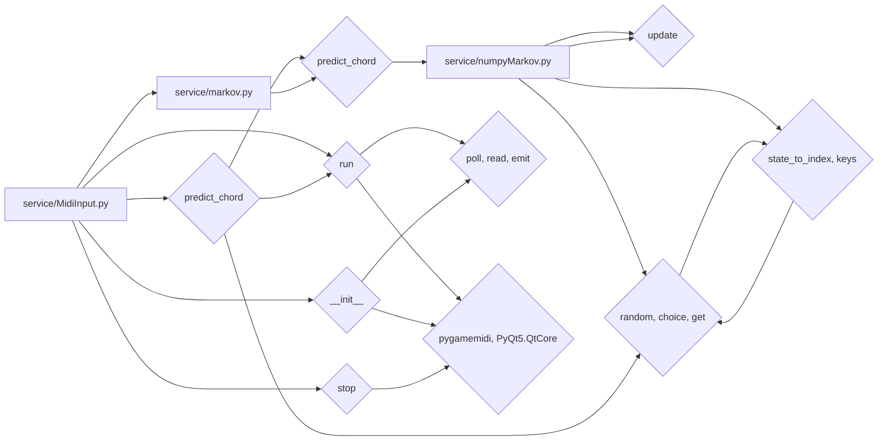

# 代码分析报告

# 一、摘要

## 基础信息
- 仓库名称：chordPrediction
- 仓库描述：和弦预测
- 仓库分支：master
- 仓库地址：https://github.com/kinglegendzzh/chordPrediction
- 项目根路径：`/Users/apple/Public/generates-git/chordPrediction`
- 分析的目标子路径：`service`

## 函数信息
### __init__ (service/MidiInput.py)
- 函数类型：function
- 功能描述：
该函数用于初始化MIDI输入设备并启动监听循环，以便从指定的MIDI设备读取输入。它首先列出所有可用的MIDI设备，并允许用户选择一个设备ID。如果没有可用设备，或者用户没有选择设备，函数将抛出一个ValueError。一旦选择了设备，函数将创建一个MIDI输入对象，并启动一个循环来监听和处理MIDI事件。

- 引入包：
pygame,pygame.midi,PyQt5.QtCore,
- 调用：
__init__,init,get_count,get_device_info,ValueError,Input,
- 内部依赖描述：
  - __init__: 该类初始化一个MIDI输入设备监听循环，允许用户选择MIDI设备，读取并处理MIDI事件，显示当前和弦和下个和弦，并通过定时器更新按钮颜色和MIDI状态。

### run (service/MidiInput.py)
- 函数类型：function
- 功能描述：
这是一个MIDI监听循环，负责监听MIDI输入事件，并根据按键的状态（按下或释放）发出相应的信号。

- 引入包：
pygame,pygame.midi,PyQt5.QtCore,
- 调用：
poll,read,emit,
- 内部依赖描述：

### predict_chord (service/markov.py)
- 函数类型：function
- 功能描述：
这个函数用于预测音乐和弦的下一个和弦。它使用马尔科夫链的模型来根据当前的和弦序列推断下一个和弦的选择，并计算该选择的概率。

- 引入包：
random,
- 调用：
choice,get,
- 内部依赖描述：

### predict_chord (service/numpyMarkov.py)
- 函数类型：function
- 功能描述：
该函数 `predict_chord` 用于根据当前和弦序列预测可能的下一和弦，并返回这些和弦的概率分布。

- 调用：
ValueError,state_to_index,keys,
- 内部依赖描述：
  - state_to_index: 该函数用于将状态（state）转换为对应的索引（index）。它根据状态中每个和弦（chord）在和弦索引表中的位置以及状态的阶数（order），计算出一个唯一的索引。

### __init__ (service/numpyMarkov.py)
- 函数类型：function
- 功能描述：
该函数用于构建和弦序列的转移矩阵，帮助分析和弦之间的转换频率。

- 调用：
index_chords,zeros,build_transition_matrix,
- 内部依赖描述：
  - index_chords: 该函数用于从给定的音序序列中提取唯一的和弦，并为每个和弦生成一个唯一的序号。
  - build_transition_matrix: 该函数用于构建一个转移矩阵（transition matrix），其中每行代表一个状态（state），每列表示从该状态过渡到下一个状态的频率。转移矩阵的元素通过将状态序列中的每个状态和下一状态之间的转移频率归一化来计算。

### stop (service/MidiInput.py)
- 函数类型：function
- 功能描述：
停止MIDI监听循环并关闭MIDI输入设备。

- 引入包：
pygame,pygame.midi,PyQt5.QtCore,
- 调用：
quit,
- 内部依赖描述：

### __init__ (service/markov.py)
- 函数类型：function
- 功能描述：
这个类用于生成和弦序列，并使用马尔科夫链来预测下一个和弦。它接受一个和弦风格、一个和弦序列列表和一个可选的阶数。类的主要功能是构建马尔科夫链并预测下一个和弦。

- 引入包：
random,

### build_transition_matrix (service/numpyMarkov.py)
- 函数类型：function
- 功能描述：
该函数用于构建一个转移矩阵（transition matrix），其中每行代表一个状态（state），每列表示从该状态过渡到下一个状态的频率。转移矩阵的元素通过将状态序列中的每个状态和下一状态之间的转移频率归一化来计算。

- 调用：
state_to_index,
- 内部依赖描述：
  - state_to_index: 该函数用于将状态（state）转换为对应的索引（index）。它根据状态中每个和弦（chord）在和弦索引表中的位置以及状态的阶数（order），计算出一个唯一的索引。

### index_chords (service/numpyMarkov.py)
- 函数类型：function
- 功能描述：
该函数用于从给定的音序序列中提取唯一的和弦，并为每个和弦生成一个唯一的序号。

- 调用：
update,
- 内部依赖描述：

### state_to_index (service/numpyMarkov.py)
- 函数类型：function
- 功能描述：
该函数用于将状态（state）转换为对应的索引（index）。它根据状态中每个和弦（chord）在和弦索引表中的位置以及状态的阶数（order），计算出一个唯一的索引。

### service (service)

### __init__.py (service/__init__.py)

# 二、分析明细

### 流程架构简要解释：

这个项目主要由 `service` 目录下的两个主要模块 `MidiInput.py` 和 `numpyMarkov.py` 组成。流程从 `MidiInput.py` 开始，通过初始化 `__init__` 方法启动 MIDI 输入设备并监听 MIDI 事件。当 MIDI 事件发生时，`run` 方法会被调用，负责处理事件并根据按键状态发出信号。`predict_chord` 方法则在 `MidiInput.py` 和 `numpyMarkov.py` 中分别实现，用于预测下一个和弦。

`numpyMarkov.py` 模块中的函数`index_chords`、`build_transition_matrix` 和 `state_to_index` 用于构建和弦序列的转移矩阵，以及将状态转换为索引，以支持马尔科夫链模型的实现。这些模块通过 `__init__.py` 进行组织，确保项目能正确运行并实现和弦预测功能。

